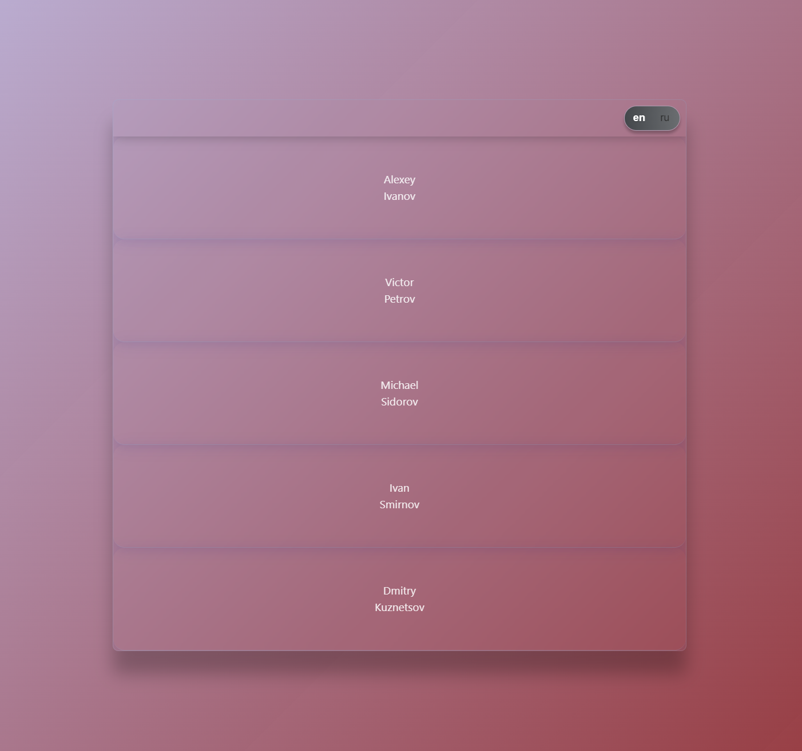

# React Test App

## Описание

Многоязычное приложение на React + TypeScript + Vite для отображения и виртуализации списка пользователей с анимацией. Использует Zustand для управления состоянием, модульные CSS, современную архитектуру компонентов и анимации через framer-motion. Проект структурирован для масштабирования и поддержки, с акцентом на чистоту кода и типизацию.

## Скриншоты



---

## Основные возможности

- Виртуализированный список пользователей с плавной анимацией появления/ухода элементов.
- Поддержка двух языков интерфейса: русский и английский.
- Централизованное управление состоянием через Zustand.
- Модульные стили для изоляции CSS.
- Современная архитектура компонентов (разделение на UI, контейнеры, утилиты).
- Асинхронная загрузка данных с обработкой статусов загрузки.
- Использование TypeScript для строгой типизации.

---

## Структура проекта

```
src/
  app/           — точка входа приложения (App)
  components/    — переиспользуемые компоненты (Header, Main, ListItems, Wrapper, UI)
  constants/     — глобальные константы и цвета
  store/         — Zustand store (userStore)
  types/         — типы данных (User, Languages)
  utils/         — утилиты для работы с API (fetchUsers)
  assets/        — ассеты (папка зарезервирована)
  index.css      — глобальные стили
  main.tsx       — точка входа React
```

---

## Быстрый старт

1. Установите зависимости:
   ```bash
   npm install
   ```
2. Запустите проект в режиме разработки:
   ```bash
   npm run dev
   ```
3. Откройте [http://localhost:5173](http://localhost:5173) в браузере.

---

## Сборка для продакшена

```bash
npm run build
```

---

## Технологии

- React 18+
- TypeScript
- Vite
- Zustand
- framer-motion
- CSS Modules

---

## Рекомендации для продакшена
- Покрыть проект модульными и UI-тестами (React Testing Library, Jest).
- Вынести все текстовые ресурсы в отдельный модуль и внедрить i18n.
- Добавить кэширование пользовательских данных. (localStorage, IndexedDB, swr, react-query, Shared Worker)
- Вынести магические числа и лимиты в конфигурационный файл.
- Покрыть ключевые пользовательские сценарии e2e-тестами (Cypress, Playwright).
- Для работы с большими объёмами данных — использовать Web Worker.


